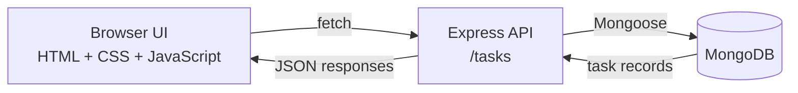

# TaskFlow

> A focused task manager with a calm interface, a lightweight API, and MongoDB persistence.

<p align="center">
	
	
	
	
</p>

TaskFlow keeps the everyday task loop simple: add an item, see it immediately, refine it when plans change, and remove it when it is done. The browser UI talks to an Express server, which stores tasks in MongoDB through Mongoose.

## What It Does

| Capability | Description |
| --- | --- |
| Create | Add a new task from the browser |
| Read | Load every saved task from the API |
| Update | Rename an existing task in place |
| Delete | Remove a task and refresh the list |
| Count | Show the current number of saved tasks |
| Persist | Keep task data in MongoDB between sessions |

## How It Fits Together



## Quick Start

### Prerequisites

- Node.js 18 or newer
- npm
- A local MongoDB server or a MongoDB Atlas database

### Install

```bash
git clone <repository-url>
cd TaskFlow_App
npm install
```

Create a `.env` file in the project root:

```env
PORT=3000
DB_URL=mongodb://127.0.0.1:27017/taskflow
```

Use your MongoDB Atlas connection string instead when working with a hosted database.

### Run

```bash
npm run dev
```

Open [http://localhost:3000](http://localhost:3000) in your browser.

## API Reference

All endpoints return JSON. The task model currently stores a required `name` field.

| Method | Endpoint | Purpose | Body |
| --- | --- | --- | --- |
| `GET` | `/tasks` | List all tasks | None |
| `POST` | `/tasks` | Create a task | `{ "name": "Plan the week" }` |
| `PUT` | `/tasks/:id` | Rename a task | `{ "name": "Plan the month" }` |
| `DELETE` | `/tasks/:id` | Delete a task | None |

Example request:

```bash
curl -X POST http://localhost:3000/tasks \
	-H "Content-Type: application/json" \
	-d '{"name":"Review project notes"}'
```

## Project Map

```text
TaskFlow_App/
├── app/
│   ├── config/db.js       # MongoDB connection
│   └── models/tasks.js     # Mongoose task schema
├── public/
│   ├── index.html          # App shell
│   ├── script.js           # API calls and UI behavior
│   └── style.css           # Interface styling
├── .env                   # Local configuration (ignored)
├── package.json           # Scripts and dependencies
├── package-lock.json       # Locked dependency versions
├── server.js              # Express server and routes
└── README.md
```

## Available Commands

| Command | What it does |
| --- | --- |
| `npm install` | Installs dependencies |
| `npm run dev` | Starts the server with Nodemon |
| `npm test` | Placeholder test script |

## Roadmap

- Add task completion states
- Add due dates and filters
- Add automated API and UI tests
- Add production configuration and deployment notes

## License

No license has been specified yet.
